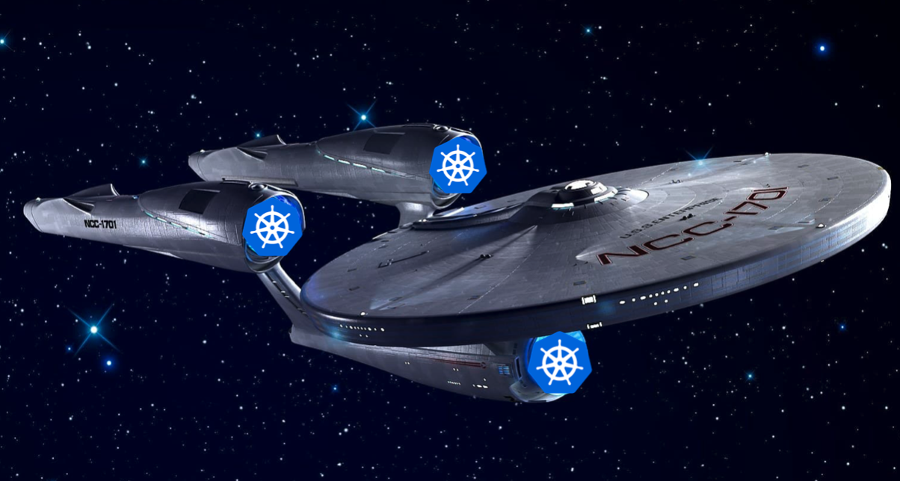
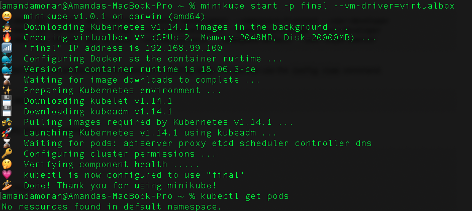
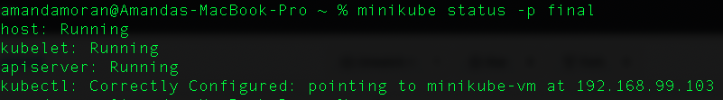
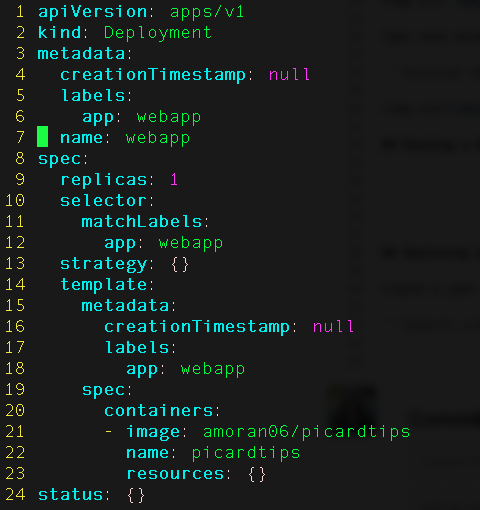
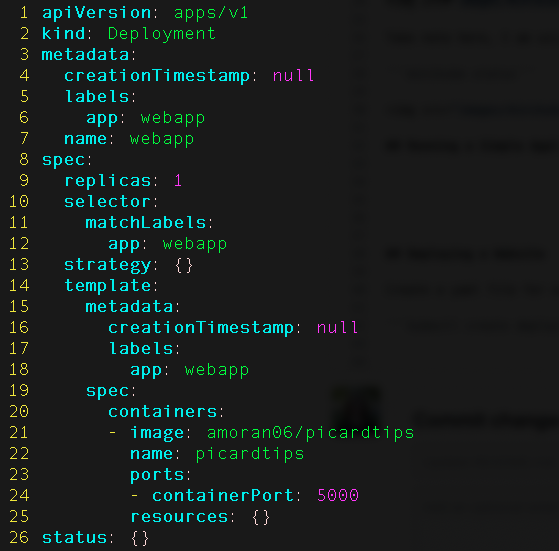

# Kubernetes: The Final Frontier 



*This is an introduction to Kubernetes tutorial. 
The continuing mission: to explore the strange new worlds of microservices, containerization, and their management. 
To seek out new skills and new adventures. 
To boldly go where no one has gone before!*

This is a hands on tutorial! I will be giving time during the tutorial to follow along with me and install MiniKube, create a sample deployement, create a docker image, and launch a web application. It might not be possible for you to do all these things in real-time with me (as installation can always take a long time!), but the video will be available and these instructions will walk you through. Thank you and see you in the stars! 

## Installing MiniKube
The Kubernetes docs have a fanastic guide to installing minikube on Linux, Mac, or Windows. Reminder, you will need to have a hypervisor installed, which might take some time. I am personally using VirutalBox.

https://kubernetes.io/docs/tasks/tools/install-minikube/


### Starting MiniKube
After installation is complete. You will want to start your first minikube kubernertes cluster

```minikube start -p final --vm-driver=virtualbox``` 



Take note here, I am using virutalbox (and so I specified that).

```minikube status```



## Running a Simple Application


## Deploying a Website 

Create a yaml file for our deployment by doing the following command: 

```kubectl create deployment webapp --image=amoran06/picardtips --dry-run=client -o yaml > webapp.yaml```


Note and credit: I was able to create this web application from this wonderful example: https://docker-curriculum.com/ I am not a web developer and so using the code found here https://github.com/prakhar1989/docker-curriculum/tree/master/flask-app to create my docker image was a life saver! Thanks to https://github.com/prakhar1989!! 


Open up the yaml with the editor of your choice (VIM for the WIN) and you should see something that looks like this: 



Next step is we will need to add a containerPort to our yaml configuration file. This is an **important** step as our flash app that we created for our website is running on port 5000, and we need to make sure that is exposed via kubernetes. 



Now that we have generated and edited our yaml file, now its time to apply it. 

```kubectl apply -f webappl.yaml```

You should see: ```deployment.apps/webapp created``` if everything has gone to plan!

Next 
