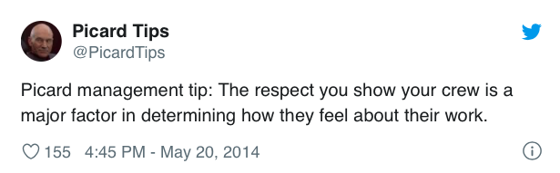

# Kubernetes: The Final Frontier 


*This is an introduction to Kubernetes tutorial. 
The continuing mission: to explore the strange new worlds of microservices, containerization, and their management. 
To seek out new skills and new adventures. 
To boldly go where no one has gone before!*

This is a hands on tutorial! I will be giving time during the tutorial to follow along with me and install Minikube, create a sample deployment, and launch a web application. It might not be possible for you to do all these things in real-time with me (as installation can always take a long time!), but the video will be available and these instructions will walk you through. Thank you and see you in the stars! 

## Installing MiniKube
The Kubernetes docs have a fantastic guide to installing Minikube on Linux, Mac, or Windows. Reminder, you will need to have a hypervisor installed, which might take some time. I am personally using VirtualBox.

https://kubernetes.io/docs/tasks/tools/install-minikube/


### Starting MiniKube
After installation is complete. You will want to start your first Minikube kubernertes cluster

```minikube start -p final --vm-driver=virtualbox``` 


Take note here, I am using virtualbox (and so I specified that).

```minikube status```


## Running a Simple Application


### Create a Pod

```kubectl run hello --image=amoran06/hellofriends```

This is a simple container that is printing out a message to all my new friends here at OSSummit. But when I deployed my container, my message didn't appear...

### Check that Pod is Running 

```kubectl get pods```

### Let's Check the Logs

```kubectl logs hello```

### Verify you see the message


## Deploying a Website 

### Create Yaml File 

Create a yaml file for our deployment by doing the following command: 

```kubectl create deployment webapp --image=amoran06/picardtips --dry-run=client -o yaml > webapp.yaml```

Open up the yaml file with the editor of your choice (VIM for the WIN) and you should see something that looks like this: 


### Edit Yaml File

Next step is we will need to add a containerPort to our yaml configuration file. This is an **important** step as our flash app that we created for our website is running on port 5000, and we need to make sure that is exposed via Kubernetes. 


### Apply Yaml File

Now that we have generated and edited our yaml file, now it’s time to apply it. 

```kubectl apply -f webappl.yaml```

You should see: ```deployment.apps/webapp created``` if everything has gone to plan!

### Creating a Load Balancer and Exposing our Deployment

Next we want to be able to see our website, we are going to need to expose our deployment to the outside world by using a load balancer. This will give us an external IP address that we can hit in combination with the port 8080.  

```kubectl expose deployment webapp --type=LoadBalancer --port=8080 --target-port=5000```

You should see: ```service/webapp exposed``` if everything has worked! 

### Check that Services and Pods are Created 

Let's just on our services and pods 

```kubectl get pods,services```

We should see both a service and pod named web-app. 

### Use Minikube to create our Load Balancer

Since we running locally we will need to create our loadbalancer by running Minikube. 

```minikube service webapp``` 

### Check out this cool web site, that we deployed with Kubernetes!

The website Picard Tips should pop up in your local browser! Read the tips, they are great, thanks twitter! 




## Creating a Highly Available Application 

If we do a ```kubectl get pods``` we wil see that we only have one webapp pod that has been created. Let's say our Picard Managmenet tips site starts getting a lot of traffic, how are we going to scale up and make sure we have a highly available app? This is where pod replicas comes into play. 

### Adding Replicas 

Open ```webapp.yaml``` and find ```replicas```


Edit this value to ```3``` and save the file. 

```kubectl get pods``` --> How many will we see?

#### Delete Pods and Services 

Shocking! Only 1. We will need to delete our current running pods and service. 

```kubectl delete deploy webapp```

```kubectl delete service webapp```

### Apply and Check Replica Count 

```kubectl apply -f webapp.yaml```

```kubectl expose deployment webapp --type=LoadBalancer --port=8080 --target-port=5000```

```kubectl get pods```


And let's doublecheck on our app! 

```minikube service webapp```


## Recap


## Resources and Credit

The Kubernetes docs are wonderful! https://kubernetes.io/docs/tutorials/hello-minikube/ This helped guide me in making this tutorial. https://kubernetes.io/blog/2019/07/23/get-started-with-kubernetes-using-python/

I was able to create this web application from this wonderful example: https://docker-curriculum.com/ I am not a web developer and so using the code found here https://github.com/prakhar1989/docker-curriculum/tree/master/flask-app to create my docker image was a life saver! Thanks to https://github.com/prakhar1989!! 
